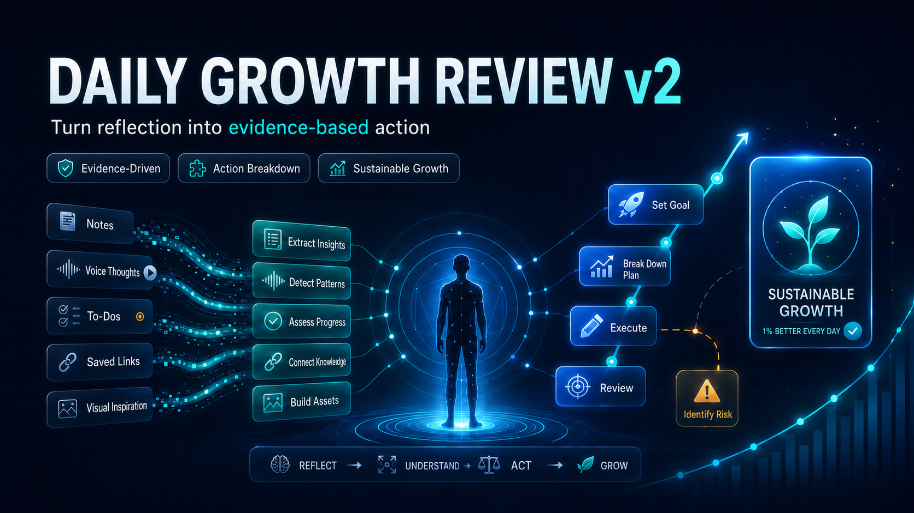
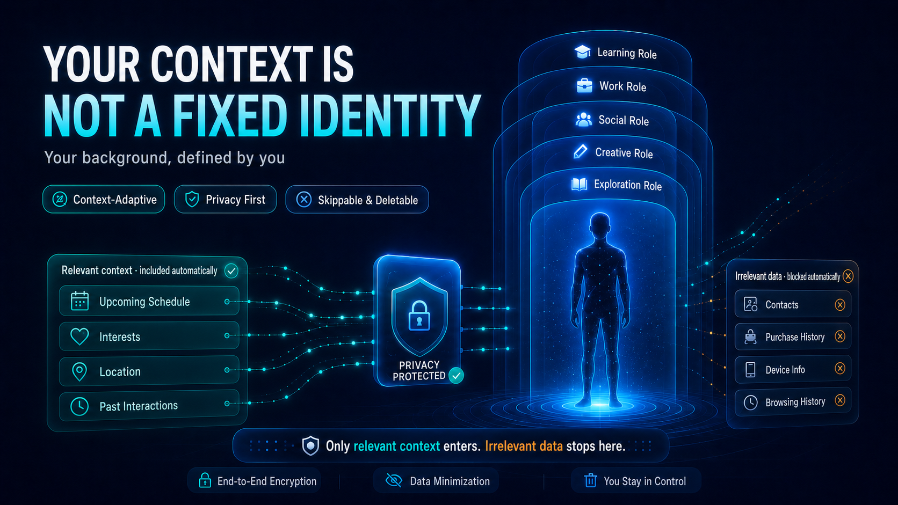
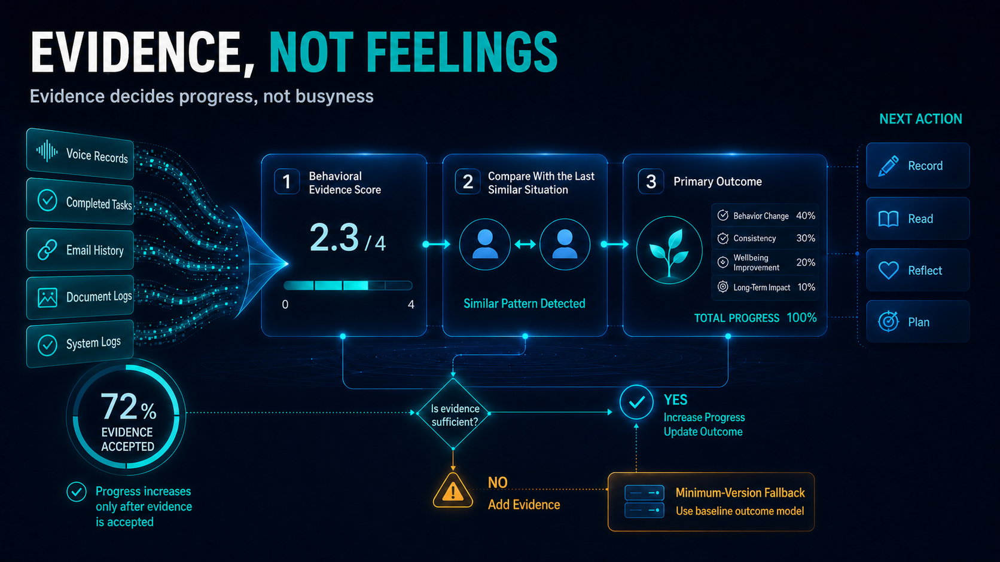
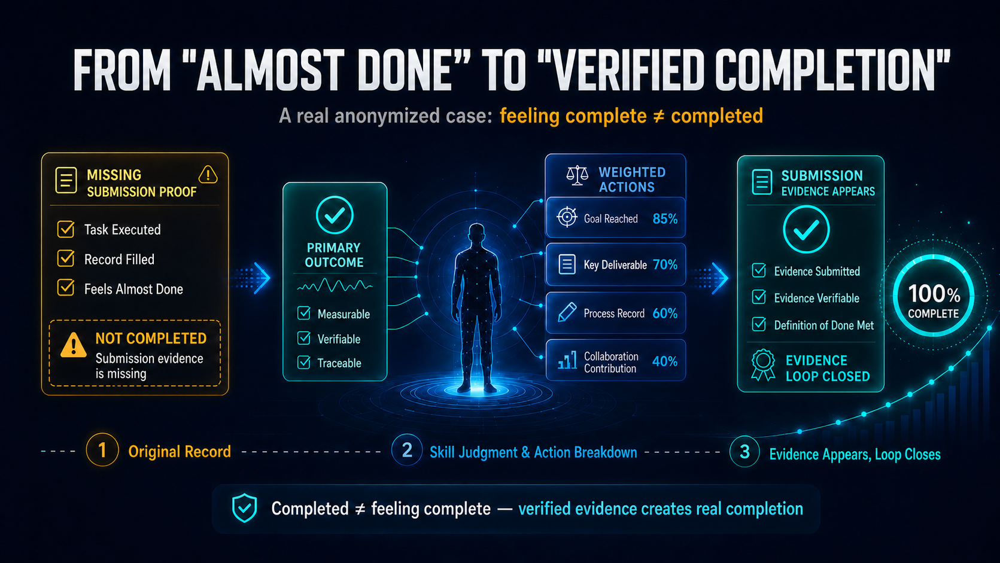
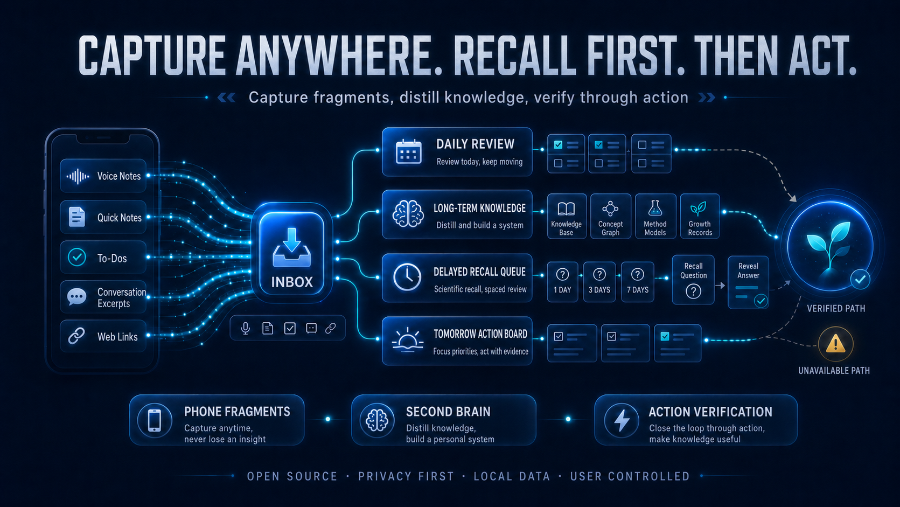

# Daily Growth Review v2

[English](README.md) | [简体中文](README.zh-CN.md) | [Version history](docs/version-history.md)

> Turn reflection into evidence-based action.



`daily-growth-review` is a background-neutral reflection Skill for **Codex, Claude Code, and DeepSeek**. It does not assume that you are a student, researcher, employee, parent, athlete, or any other fixed identity. It learns only the context that changes the review, tests progress against evidence, and converts reflection into one realistic next outcome.

## What v2 changes

- **Adaptive profile:** gathers current roles, one to three goals, constraints, resources, and feedback boundaries one question at a time.
- **Evidence before scores:** uses a 0–4 behavioral anchor instead of a motivational total.
- **Fair comparison:** compares growth with the last similar situation, not automatically with yesterday.
- **One primary outcome:** splits tomorrow's main result into 3–5 weighted subtasks totaling 100.
- **Verified progress:** raises `progress_percent` only when accepted evidence meets the definition of done.
- **Delayed recall:** asks you to retrieve important learning before showing the old answer.
- **Capture Inbox:** gives phone fragments, audio, messages, notes, and links one source-preserving schema.
- **Honest connectors:** uses Notion, reminders, WeChat, email, and other services only when real tools and permissions exist.

## Your context, not a fixed identity



The public Skill asks only four essential areas progressively:

1. current roles or life stage;
2. one to three goals for the current cycle;
3. constraints and available resources;
4. feedback preference and analysis boundaries.

Age, family, health, finances, institution, culture, and relationships are optional. The Skill asks for them only when relevant, explains why, and always permits skip or deletion.

Keep real profiles, daily reviews, Notion identifiers, connector secrets, private transcripts, relationship notes, and health context outside Git.

## Evidence decides progress



### Evidence score: 0–4

| Score | Meaning |
|---:|---|
| 0 | No evidence or clear harmful regression |
| 1 | Recognition without effective action |
| 2 | Meaningful partial action, not yet complete |
| 3 | Independently met the definition of done |
| 4 | Met it with improved quality, independence, transfer, efficiency, or sustainability |

Use the last similar situation for `comparison_delta` from -2 to +2. If no comparable event exists, store `baseline_missing` and treat today as the first baseline.

## From almost done to verified completion



This anonymized case expresses the core rule: execution and a filled record may still be incomplete when required submission evidence is missing. The Skill identifies the gap, creates a concrete next action, and marks completion only when the evidence is submitted, verifiable, and satisfies the definition of done.

## Capture, recall, and act



```yaml
capture_id:
captured_at:
source:
type: thought | task | link | audio | event | learning
raw_content:
context:
confidence: high | medium | low | unknown
processed: false
```

The user's direct summary remains the mainline. Automated transcripts, links, and logs are confidence-ranked patches. Important learning enters a delayed-recall queue; generated explanations do not count as mastery until the user recalls, speaks, records, teaches, reconstructs, or transfers them.

## Tomorrow execution board

```yaml
primary_outcome: Submit a complete application draft
definition_of_done: One reviewable PDF exists and required fields are complete
subtasks:
  - title: Confirm requirements
    weight: 15
    evidence: Saved checklist
  - title: Draft core content
    weight: 40
    evidence: Complete editable draft
  - title: Add supporting material
    weight: 25
    evidence: Required files attached
  - title: Review and export
    weight: 20
    evidence: Reviewable PDF
support_tasks:
  - Thirty-minute recovery session
progress_percent: 0
```

Only accepted evidence raises the progress bar. Support tasks do not inflate the primary outcome.

## Connector boundaries

- A Skill cannot monitor personal **WeChat** by itself. Receiving messages requires a supported official account or enterprise application, a server, permissions, and a real connector.
- A group webhook that sends messages does not automatically receive user messages.
- A shared **Douyin** link does not guarantee access to the video or captions. If unreadable, the Skill preserves the URL and requests a transcript, captions, screenshots, or notes.
- A **Notion** write is complete only after the tool succeeds and the destination is read back when supported.
- A reminder is created only when scheduling capability exists and the user approves its time and recurrence.

When a connector is unavailable, the Skill returns copyable Markdown or YAML and states that no external action occurred.

## Install

### Codex

```powershell
Copy-Item -Recurse -Force .\daily-growth-review "$env:USERPROFILE\.codex\skills\daily-growth-review"
```

### Claude Code

```powershell
Copy-Item -Recurse -Force .\claude\daily-growth-review "$env:USERPROFILE\.claude\skills\daily-growth-review"
```

### DeepSeek

Use `deepseek/system-prompt.md` for a readable prompt or `deepseek/system-prompt.txt` for API loading. Neutral examples are in `deepseek/user-prompts.md`.

## Use

```text
$daily-growth-review Audit yesterday, compare today only with a similar situation, and build one weighted primary outcome for tomorrow.
```

```text
$daily-growth-review Test my recall from yesterday before showing me the old explanation.
```

## Package structure

```text
assets/v2/en/                 English campaign images
assets/v2/zh/                 Simplified Chinese campaign images
daily-growth-review/          Codex Skill
claude/daily-growth-review/   Claude mirror
deepseek/                     Prompt pack and API example
shared/core-method.md         Platform-neutral contract
tests/                        Release and behavior validation
```

## Releases

The original implementation is preserved as [`v1.0.0`](https://github.com/Hu-yucheng/daily-growth-review-skill/tree/v1.0.0). The current bilingual release is [`v2.0.0`](https://github.com/Hu-yucheng/daily-growth-review-skill/tree/v2.0.0). See the [version history](docs/version-history.md) for the non-destructive upgrade policy.

## License

MIT
