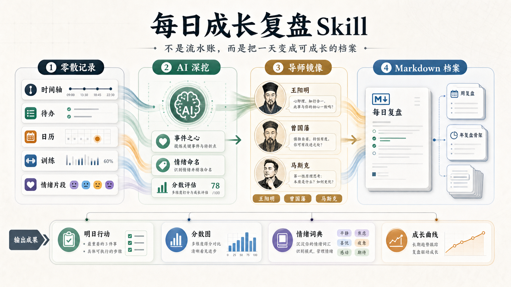
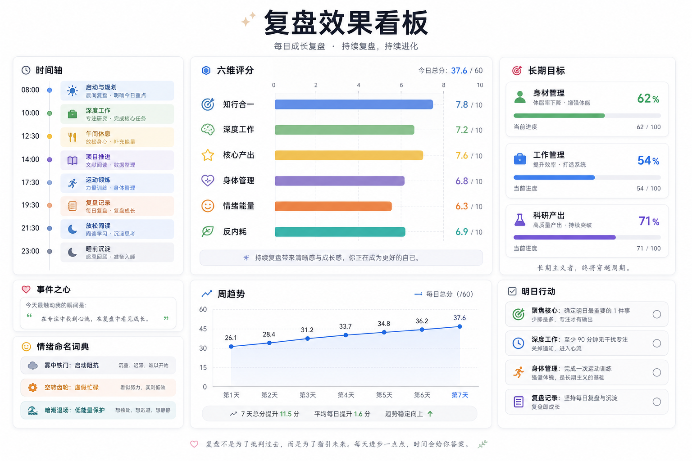
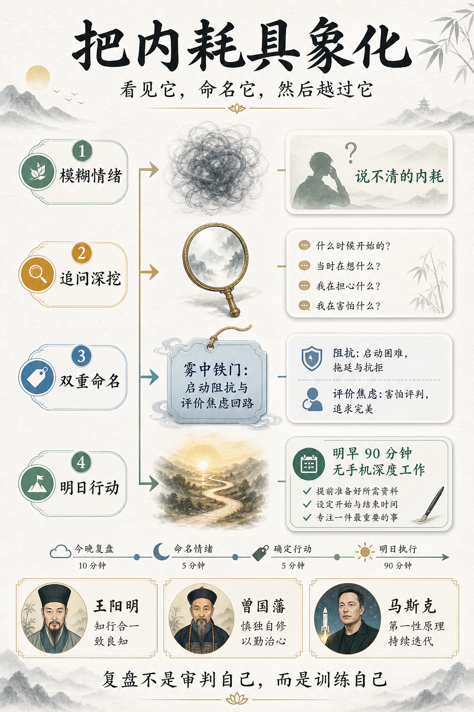

# 每日成长复盘 Skill

> 不是流水账，而是把一天变成可成长的档案。

`daily-growth-review` 是一个面向 Codex 的个人复盘 Skill。它会把零散的时间轴、待办、日历片段、训练记录、聊天摘要或口述经历，整理成一份 Markdown 成长档案：重建一天的时间线，找出最有意义的“事件之心”，深挖开心、内耗、沮丧或低能量背后的机制，并用导师框架给出明日行动。




## 目录

- [它解决什么问题](#它解决什么问题)
- [核心能力](#核心能力)
- [效果预览](#效果预览)
- [安装](#安装)
- [使用方式](#使用方式)
- [输出结构](#输出结构)
- [导师框架](#导师框架)
- [项目结构](#项目结构)
- [设计参考](#设计参考)

## 它解决什么问题

很多复盘最后会变成两种东西：

- 流水账：记录了今天做了什么，但没有真正看见模式。
- 自我攻击：知道自己拖延、内耗、低效，但越复盘越沉重。

这个 Skill 的目标不是审判自己，而是训练自己。它会把一天里的事件、情绪、能量和行动拆开，帮你看见：

- 今天最值得被看见的“事件之心”是什么？
- 内耗、沮丧、开心或低能量背后是什么机制？
- 今天的行为离长期目标更近，还是更远？
- 明天最小但有效的一步是什么？

## 核心能力

| 模块 | 作用 |
|---|---|
| 时间轴重建 | 把零散记录整理成可读的日内路径 |
| 事件之心 | 找到当天最有意义的阻碍、转折或高价值事件 |
| 情绪具象化 | 将模糊情绪命名为“诗性名字：机制名字” |
| 三导师镜像 | 用王阳明、曾国藩、马斯克审视行动和偏差 |
| 六维评分 | 跟踪知行合一、深度工作、核心产出、身体管理、情绪能量、反内耗 |
| 长期目标 | 默认跟踪身材管理、工作管理、科研产出 |
| 周复盘索引 | 每日输出稳定字段，方便之后做周复盘和年复盘 |

## 效果预览

### 复盘效果看板

复盘后不只是得到一段文字，而是形成可以继续积累的成长看板：时间轴、六维评分、长期目标、情绪命名词典、周趋势和明日行动都在同一个系统里。



### 把内耗具象化

Skill 会把“说不清的内耗”转成可面对、可命名、可行动的对象。

例如：

```text
说不清的内耗
→ 雾中铁门：启动阻抗与评价焦虑回路
→ 明早 90 分钟无手机深度工作
```



## 安装

把 `daily-growth-review` 文件夹复制到你的 Codex skills 目录。

Windows PowerShell:

```powershell
Copy-Item -Recurse -Force .\daily-growth-review "$env:USERPROFILE\.codex\skills\daily-growth-review"
```

macOS / Linux:

```bash
mkdir -p ~/.codex/skills
cp -R ./daily-growth-review ~/.codex/skills/daily-growth-review
```

安装后，在新对话或重新加载技能后即可使用。

## 使用方式

每日复盘：

```text
$daily-growth-review 帮我做今天的复盘。
上午写论文但效率一般，下午刷手机有点内耗，晚上练背，状态回升了一点。
```

深挖模式：

```text
$daily-growth-review 用深挖模式复盘今天，重点分析我为什么拖延科研。
```

严厉拷问模式：

```text
$daily-growth-review 用严厉拷问模式复盘今天，但不要自我攻击，要给出明天的铁律。
```

周复盘：

```text
$daily-growth-review 这里是我 7 天的每日复盘，请帮我做周复盘，找出重复阻碍和下周主战役。
```

## 输出结构

每日复盘默认输出：

```markdown
# 每日成长复盘 - YYYY-MM-DD

## 0. 今日一句话
## 1. 时间轴图
## 2. 今日事件之心
## 3. 情绪显影与命名
## 4. 三导师镜像
## 5. 评分与距离目标
## 6. 明日行动选项
## 7. 周复盘索引字段
```

周复盘会聚合 7 天内容，提炼：

- 重复出现的阻碍
- 重复出现的力量
- 情绪命名词典
- 三导师趋势
- 六维评分趋势
- 下周主战役

年复盘第一期提供骨架，用于承接长期材料。

## 导师框架

默认三导师：

| 导师 | 核心问题 |
|---|---|
| 王阳明 | 今天哪里知行合一？哪里明知应做却没有做到？ |
| 曾国藩 | 今日之过是什么？哪个微小习惯让防线崩溃？ |
| 马斯克 | 这件事的第一性原理是什么？明天最小极限动作是什么？ |

可选扩展视角：

- 费曼：把复杂问题讲清楚。
- 查理·芒格：反向思考，避免愚蠢。

## 项目结构

```text
daily-growth-review/
  SKILL.md
  agents/
    openai.yaml
  references/
    daily-template.md
    weekly-template.md
    yearly-template.md
    mentor-frameworks.md
    interview-prompts.md
```

## 设计参考

这个 README 的展示结构参考了高收藏项目的常见做法，但没有复制任何模板内容：

- [awesome-readme](https://github.com/matiassingers/awesome-readme) 总结了优秀 README 常见元素，包括图片、截图、GIF、格式化文本等。
- [Best-README-Template](https://github.com/othneildrew/Best-README-Template) 使用了首屏 badges、目录、About、Getting Started、Usage 等清晰结构。
- [awesome-github-profile-readme](https://github.com/abhisheknaiidu/awesome-github-profile-readme) 把优秀展示分成 Minimalistic、Descriptive、GIFS、Badges、Icons 等类别，说明“视觉首屏 + 清晰分类”很重要。

## License

MIT
