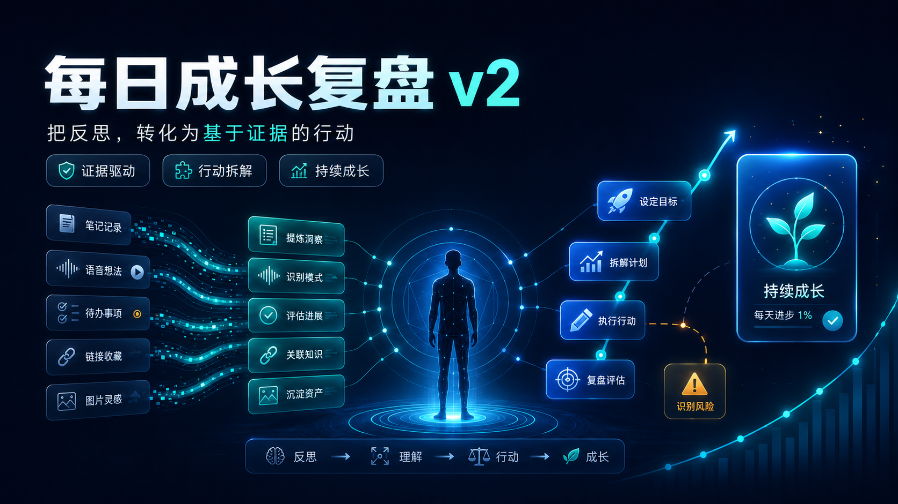
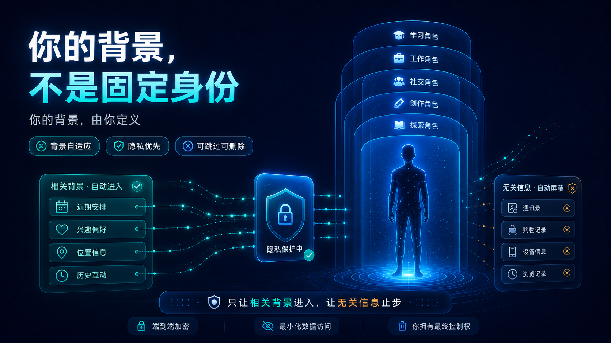
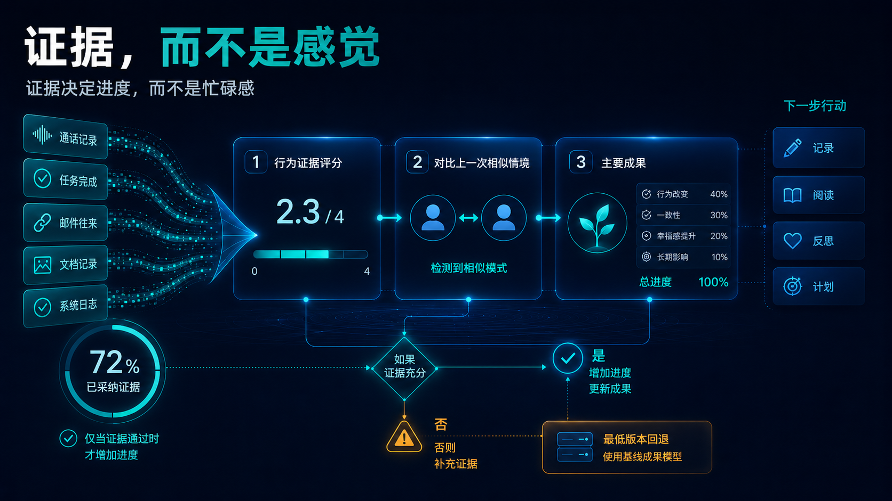
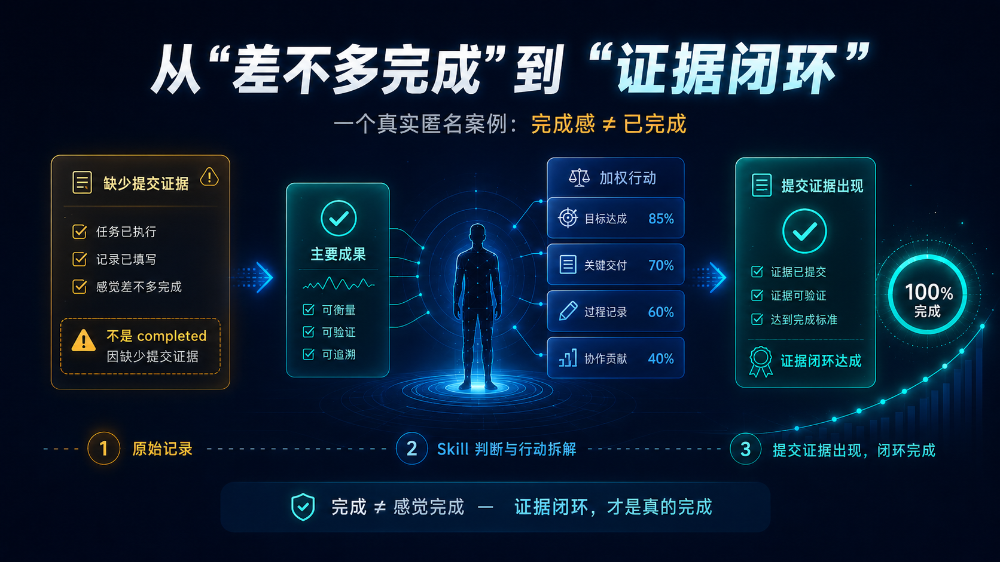
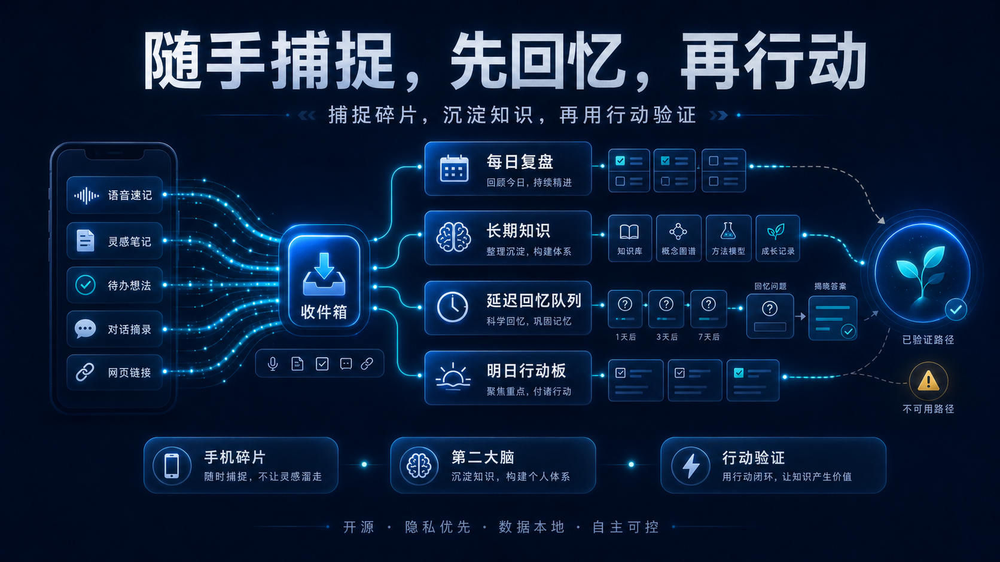

# 每日成长复盘 v2

[English](README.md) | [简体中文](README.zh-CN.md) | [版本历史](docs/version-history.md)

> 把反思转化为基于证据的行动。



`daily-growth-review` 是一个适用于 **Codex、Claude Code 和 DeepSeek** 的背景自适应复盘 Skill。它不会预设你是学生、研究者、职员、家长、运动者或任何固定身份；它只逐步了解真正影响复盘的背景，以证据判断进度，并把反思转化为一个现实可执行的下一步成果。

## v2 升级了什么

- **背景自适应：** 每次只问一个关键问题，逐步了解当前角色、1–3 个阶段目标、限制与资源、反馈边界。
- **先证据，后打分：** 使用 0–4 分行为锚点，而不是空泛的激励总分。
- **公平比较：** 与上一次相似情境比较，而不是机械地只和昨天比较。
- **一个主要成果：** 把明天最重要的成果拆成 3–5 个权重合计 100 的子任务。
- **可验证进度：** 只有被接纳、达到完成标准的证据才增加 `progress_percent`。
- **延迟回忆：** 先让你回忆重要知识，再显示过去的答案。
- **碎片收件箱：** 手机碎片、语音、消息、笔记和链接使用同一个保留来源的结构。
- **诚实的联动边界：** 只有在真实工具和权限存在时，才调用 Notion、提醒、微信、邮件等服务。

## 你的背景，不是固定身份



公开 Skill 只会逐步了解四类必要背景：

1. 你当前的角色或人生阶段；
2. 本阶段的 1–3 个目标；
3. 限制条件与可用资源；
4. 反馈偏好与分析边界。

年龄、家庭、健康、财务、学校或单位、文化与关系背景都属于可选信息。只有在确实影响判断时才会询问，并说明原因；你始终可以跳过或删除。

真实个人档案、每日复盘、Notion 标识、连接器密钥、私人转录、关系笔记与健康信息都不应提交到 Git。

## 证据决定进度



### 行为证据评分：0–4 分

| 分数 | 含义 |
|---:|---|
| 0 | 没有证据，或出现明确的有害退步 |
| 1 | 已经意识到问题，但没有产生有效行动 |
| 2 | 有实质性部分行动，但尚未完成 |
| 3 | 独立达到事先定义的完成标准 |
| 4 | 在质量、独立性、迁移、效率或可持续性上进一步升级 |

`comparison_delta` 使用 -2 到 +2，并与上一次相似情境比较。如果没有可比事件，则记录 `baseline_missing`，把今天作为第一条基线。

## 从“差不多完成”到“证据闭环”



这个匿名案例表达了核心规则：任务执行了、记录也填了，但如果缺少必要的提交证据，就还不能称为完成。Skill 会识别缺口，生成一个具体的下一步行动；只有当证据已提交、可验证并达到完成标准时，才标记为完成。

## 随手捕捉、延迟回忆、行动验证



```yaml
capture_id:
captured_at:
source:
type: thought | task | link | audio | event | learning
raw_content:
context:
confidence: high | medium | low | unknown
processed: false
```

用户自己的直接总结永远是主线，自动转录、链接和日志只是按可信度排序的补丁。重要知识会进入延迟回忆队列；只有当用户真正回忆、说出、记录、教授、重构或迁移后，才算掌握，而不是因为 AI 生成过解释就算学会。

## 明日行动板

```yaml
primary_outcome: 提交一份完整的申请书草稿
definition_of_done: 已生成可审阅 PDF，且必填项完整
subtasks:
  - title: 核对要求
    weight: 15
    evidence: 已保存核对清单
  - title: 撰写核心内容
    weight: 40
    evidence: 完整可编辑草稿
  - title: 补齐支撑材料
    weight: 25
    evidence: 必要附件已加入
  - title: 检查并导出
    weight: 20
    evidence: 可审阅 PDF
support_tasks:
  - 恢复训练 30 分钟
progress_percent: 0
```

只有被接纳的证据才会推动进度条。辅助任务不会虚增主要成果的进度。

## 外部联动边界

- Skill 无法自行监听个人**微信**。接收消息需要受支持的公众号或企业应用、服务器、权限和真实连接器。
- 只能发送消息的群机器人 Webhook，不等于可以接收用户消息。
- 分享一个**抖音**链接不代表一定能读取视频与字幕；无法读取时，Skill 会保留链接，并请求转录、字幕、截图或用户笔记。
- **Notion** 写入只有在工具成功且支持时完成回读后，才算真正完成。
- 只有存在日程能力，并且用户确认时间与重复规则后，才创建提醒。

连接器不可用时，Skill 会返回可复制的 Markdown 或 YAML，并明确说明没有发生外部操作。

## 安装

### Codex

```powershell
Copy-Item -Recurse -Force .\daily-growth-review "$env:USERPROFILE\.codex\skills\daily-growth-review"
```

### Claude Code

```powershell
Copy-Item -Recurse -Force .\claude\daily-growth-review "$env:USERPROFILE\.claude\skills\daily-growth-review"
```

### DeepSeek

可读版本使用 `deepseek/system-prompt.md`，API 加载使用 `deepseek/system-prompt.txt`；中性示例位于 `deepseek/user-prompts.md`。

## 使用示例

```text
$daily-growth-review 审计昨天的承诺，只与相似情境比较，并为明天建立一个带权重的主要成果。
```

```text
$daily-growth-review 先测试我对昨天知识的回忆，再显示旧答案。
```

## 仓库结构

```text
assets/v2/en/                 英文宣传图
assets/v2/zh/                 简体中文宣传图
daily-growth-review/          Codex Skill
claude/daily-growth-review/   Claude 镜像
deepseek/                     提示词包与 API 示例
shared/core-method.md         跨平台核心契约
tests/                        发布与行为验证
```

## 历史版本

原始实现保留为 [`v1.0.0`](https://github.com/Hu-yucheng/daily-growth-review-skill/tree/v1.0.0)，当前双语版本为 [`v2.0.0`](https://github.com/Hu-yucheng/daily-growth-review-skill/tree/v2.0.0)。详见[版本历史](docs/version-history.md)，升级不会覆盖旧版本。

## 许可证

MIT
